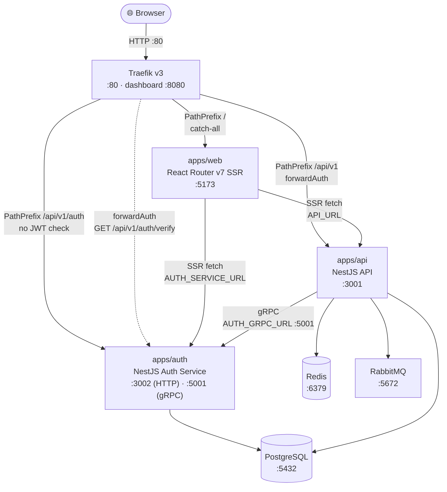
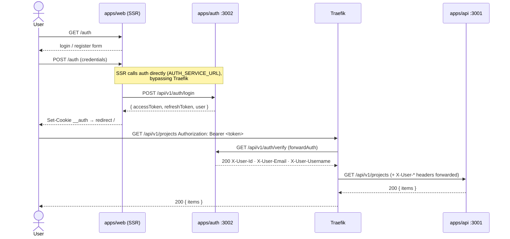
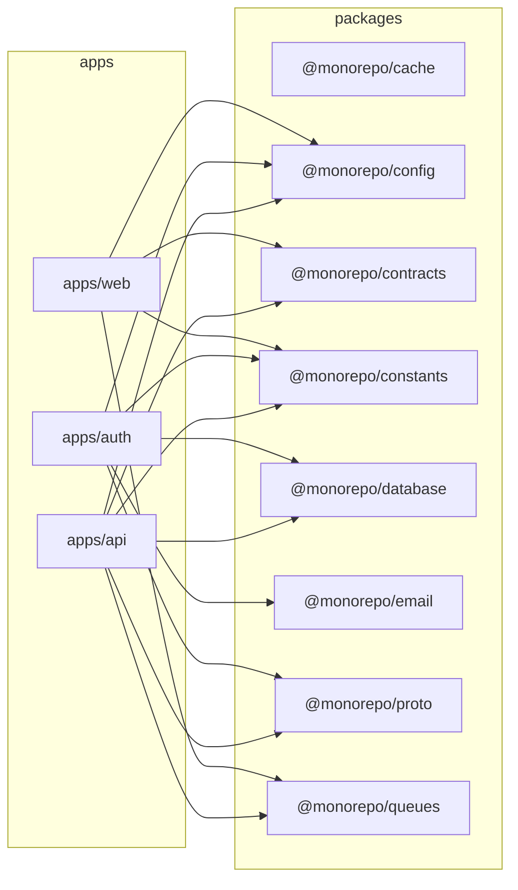

# Monorepo Boilerplate

PNPM workspace with a React Router v7 SSR frontend, a NestJS API, a NestJS auth microservice, and Traefik as the API gateway.

| App / Package        | Description                                                                        |
| -------------------- | ---------------------------------------------------------------------------------- |
| `apps/web`           | React Router v7 framework app with server-side rendering                           |
| `apps/auth`          | NestJS auth microservice — JWT (15m access + 30d refresh rotation), email verify, password reset, profile, audit trail |
| `apps/api`           | NestJS API server — projects, profile (via gRPC), BullMQ, RabbitMQ                 |
| `packages/cache`     | Redis cache helpers via ioredis (get, set, del, exists, expire, ttl)               |
| `packages/config`    | Shared env/config helpers for ports, origins, and API paths                        |
| `packages/constants` | Shared queue names, BullMQ/email defaults, and event constants                     |
| `packages/contracts` | Shared TypeScript contracts consumed by both apps                                  |
| `packages/database`  | Shared Drizzle ORM schema, client, and repositories                                |
| `packages/email`     | Email transport (nodemailer) + Handlebars HTML templates                            |
| `packages/proto`     | Shared Protobuf definitions and TypeScript interfaces for gRPC                     |
| `packages/queues`    | Shared BullMQ and RabbitMQ helpers consumed by both apps                           |

---

## Architecture

### System Overview



All routes are versioned under `/api/v1`. Traefik determines route priority by rule length — `PathPrefix('/api/v1/auth')` (longer) wins over `PathPrefix('/api/v1')` automatically, so auth routes are never gated by the JWT middleware.

### Auth Request Flow



### Package Dependency Graph



### Service Ports

| Service           | Port   | Notes                                                   |
| ----------------- | ------ | ------------------------------------------------------- |
| Traefik           | `80`   | Single ingress for browser traffic                      |
| Traefik dashboard | `8080` | Dev only                                                |
| apps/web          | `5173` | Also served through Traefik at `/`                      |
| apps/auth         | `3002` | Also served through Traefik at `/api/v1/auth`           |
| apps/auth gRPC    | `5001` | Internal gRPC server, consumed by apps/api              |
| apps/api          | `3001` | Also served through Traefik at `/api/v1` (JWT required) |
| PostgreSQL        | `5432` | Shared by auth and api                                  |
| Redis             | `6379` | BullMQ queues (auth email + api jobs)                   |
| RabbitMQ          | `5672` | Message broker (`15672` management UI)                  |
| MailDev           | `1080` | Dev email UI (`1025` SMTP)                              |

---

For production deployment instructions see [DEPLOY.md](DEPLOY.md).

---

## Requirements

- Node.js 24+
- pnpm 10+
- PostgreSQL 17 (local dev without Docker)

## Install

```bash
pnpm install
```

The shared workspace packages build to `dist/` and root install runs that build automatically.

Example environment files are provided in:

- `apps/web/.env.example`
- `apps/auth/.env.example`
- `apps/api/.env.example`
- `packages/database/.env.example`

## Development

### Option A — Docker Compose (recommended)

Starts the entire stack with a single command. PostgreSQL, Redis, RabbitMQ, and all three apps run as containers. The two service databases (`monorepo_auth`, `monorepo_api`) are created automatically on first startup via `docker/postgres-init.sql`.

```bash
docker compose -f docker-compose.dev.yml up --build
```

Services started:

| Service   | URL                              |
| --------- | -------------------------------- |
| web       | <http://localhost:5173>          |
| auth      | <http://localhost:3002>          |
| api       | <http://localhost:3001>          |
| traefik   | <http://localhost:80> · dashboard <http://localhost:8080> |
| postgres  | `localhost:5432`                 |
| redis     | `localhost:6379`                 |
| rabbitmq  | `localhost:5672` · management <http://localhost:15672> |
| maildev   | <http://localhost:1080> (email UI) · SMTP `localhost:1025` |

Stop the stack:

```bash
docker compose -f docker-compose.dev.yml down
```

---

### Option B — Local (no Docker)

**1. Prerequisites**

Install and start PostgreSQL 17, Redis, and RabbitMQ locally (or use individual Docker containers).

**2. Create the two service databases**

```bash
psql -U postgres -c "CREATE DATABASE monorepo_auth;"
psql -U postgres -c "CREATE DATABASE monorepo_api;"
```

**3. Copy and fill in the env files**

```bash
cp apps/auth/.env.example   apps/auth/.env
cp apps/api/.env.example    apps/api/.env
cp apps/web/.env.example    apps/web/.env
```

Edit each `.env` file if your local service URLs differ from the defaults.

**4. Push database schemas**

```bash
pnpm db:push:auth   # creates tables in monorepo_auth
pnpm db:push:api    # creates tables in monorepo_api
```

**5. Run all apps**

```bash
pnpm dev
```

Or run apps individually:

```bash
pnpm dev:web
pnpm dev:api
# apps/auth has no dedicated root script — run from its own directory:
pnpm --filter auth dev
```

---

App URLs:

- Web: <http://localhost:5173>
- Auth: <http://localhost:3002>
- API: <http://localhost:3001>

The SSR home route calls the Nest API health endpoint during its loader.

- Health endpoint: <http://localhost:3001/health>
- Projects endpoint: <http://localhost:3001/api/v1/projects>
- Queue status endpoint: <http://localhost:3001/api/v1/projects/queue>
- RabbitMQ status endpoint: <http://localhost:3001/api/v1/rabbitmq>
- RabbitMQ publish endpoint: `POST /api/v1/rabbitmq/projects/sync`
- Optional server-side override: set `API_URL` before starting the web app
- Optional shared env values: `WEB_PORT`, `API_PORT`, `WEB_URL`, `API_URL`, `PUBLIC_API_BASE_PATH`, `AUTH_DATABASE_URL`, `API_DATABASE_URL`, `REDIS_URL`, `RABBITMQ_URL`, `BULLMQ_ENABLED`, `RABBITMQ_ENABLED`, `BULLMQ_PREFIX`, `AUTH_PORT`, `AUTH_GRPC_PORT`, `AUTH_GRPC_URL`, `SMTP_HOST`, `SMTP_PORT`, `SMTP_SECURE`, `SMTP_USER`, `SMTP_PASS`, `SMTP_FROM`
- Shared response type: `ApiHealth` from `@monorepo/contracts`

Example:

```bash
API_URL=http://127.0.0.1:3001 pnpm dev:web
```

The shared config package exports helpers used by both apps:

- `getWebPort()` and `getApiPort()`
- `getWebOrigin()` and `getApiOrigin()`
- `getPublicApiBasePath()`, `getHealthUrl()`, and `getProjectsUrl()`
- `getAuthDatabaseUrl()` and `getApiDatabaseUrl()`
- `getRedisUrl()`, `getRabbitMqUrl()`, `isBullMqEnabled()`, `isRabbitMqEnabled()`, `getBullMqPrefix()`, and `getProjectsQueueName()`
- `getAuthGrpcPort()` and `getAuthGrpcUrl()`

Drizzle usage in this starter:

- `packages/database` is split into two sub-path exports — `@monorepo/database/auth` (users, refresh_tokens, verification_tokens, audit_logs schema + repositories, `monorepo_auth` database) and `@monorepo/database/api` (projects schema + repository, `monorepo_api` database)
- Each service uses its own dedicated Drizzle client and migration folder (`drizzle/auth/` and `drizzle/api/`)
- The projects endpoint is backed by Drizzle and seeds default rows if the table is empty

BullMQ usage in this starter:

- The web app can enqueue a projects sync job from the SSR route through `@monorepo/queues/bullmq`
- The API app uses `@nestjs/bullmq` for the worker integration and exposes queue status at `/api/v1/projects/queue`
- The auth app uses `@nestjs/bullmq` for async email sending with 5 retries (exponential backoff)
- Queue names, BullMQ retry/backoff defaults, cleanup policy, and worker event names live in `@monorepo/constants`

RabbitMQ usage in this starter:

- The shared `@monorepo/queues/rabbitmq` entrypoint still exposes low-level helpers for non-Nest consumers or publishers
- The API app itself now uses Nest microservices transport for RabbitMQ
- The sample consumer is implemented with `@MessagePattern('projects.sync')`
- The sample publisher endpoint at `POST /api/v1/rabbitmq/projects/sync` publishes through Nest `ClientProxy`
- Queue and pattern defaults live in `@monorepo/constants`

gRPC usage in this starter:

- The `packages/proto` package owns the Protobuf definitions (`proto/auth.proto`) and exports TypeScript interfaces and `getAuthProtoPath()` for resolving the `.proto` file at runtime
- The auth service exposes a gRPC server on port `5001` via `Transport.GRPC` (env: `AUTH_GRPC_PORT`)
- Two RPCs are implemented in `apps/auth/src/auth-grpc/auth-grpc.controller.ts`:
  - `VerifyToken` — decodes a JWT and returns `{ valid, userId, email, username }`
  - `GetUser` — looks up a user by ID and returns `{ found, userId, email, username }`
- The API app registers a `ClientsModule` gRPC client pointing to `AUTH_GRPC_URL` (default: `127.0.0.1:5001`)
- `AuthGrpcService` in `apps/api/src/auth-grpc/auth-grpc.service.ts` wraps the client and can be injected into any feature module:

```typescript
// Inject into any service or controller inside apps/api
constructor(private readonly authGrpcService: AuthGrpcService) {}

this.authGrpcService.verifyToken(token).subscribe(res => { /* res.valid, res.userId */ });
this.authGrpcService.getUser(userId).subscribe(res => { /* res.found, res.username */ });
```

- Test directly with `grpcurl`:

```bash
grpcurl -plaintext -proto packages/proto/proto/auth.proto \
  -d '{"token":"<jwt>"}' localhost:5001 auth.AuthService/VerifyToken

grpcurl -plaintext -proto packages/proto/proto/auth.proto \
  -d '{"user_id":"<uuid>"}' localhost:5001 auth.AuthService/GetUser
```

Run one app at a time:

```bash
pnpm dev:web
pnpm dev:api
pnpm --filter auth dev
```

## Production

Build both apps:

```bash
pnpm build
```

If you only need the shared workspace packages rebuilt, run:

```bash
pnpm run build:packages
```

Generate a new shared workspace package:

```bash
pnpm gen:package my-package
```

This creates `packages/my-package` with a standard `package.json`, `tsconfig.json`, and `src/index.ts`. New packages are picked up automatically by `build:packages`, `watch:packages`, `typecheck`, and `clean`.

Advanced generator options:

```bash
pnpm gen:package my-package --workspace-dep config --workspace-dep contracts --dep zod@^4.3.6 --export cli --export internal/helpers --with-test
```

Supported flags:

- `--workspace-dep <name>` adds `@monorepo/<name>: workspace:*` to `dependencies`
- `--dep <name@version>` adds an external dependency to `dependencies`
- `--export <subpath>` creates `src/<subpath>/index.ts` and registers `./<subpath>` in `exports`
- `--with-test` creates `src/index.test.ts` and adds a package-level `test` script

Database helpers:

```bash
# Push schemas to their respective databases (no migration files)
pnpm db:push:auth
pnpm db:push:api

# Generate SQL migration files
pnpm db:generate:auth
pnpm db:generate:api

# Apply migration files
pnpm db:migrate:auth
pnpm db:migrate:api

# Open Drizzle Studio
pnpm db:studio:auth
pnpm db:studio:api
```

Start both production servers:

```bash
pnpm start
```

Default production ports:

- Web: <http://localhost:3000>
- API: <http://localhost:3001>

## Other Scripts

```bash
pnpm typecheck
pnpm lint
pnpm test
pnpm test:e2e
pnpm format
```
