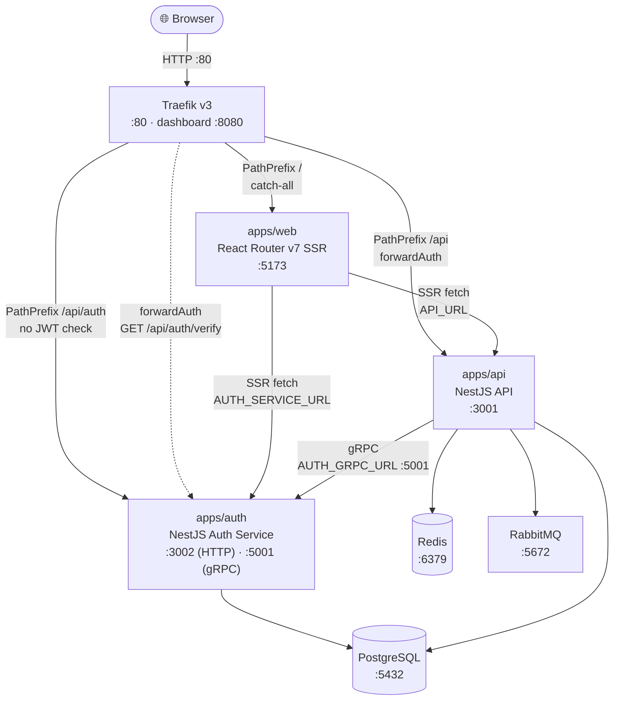
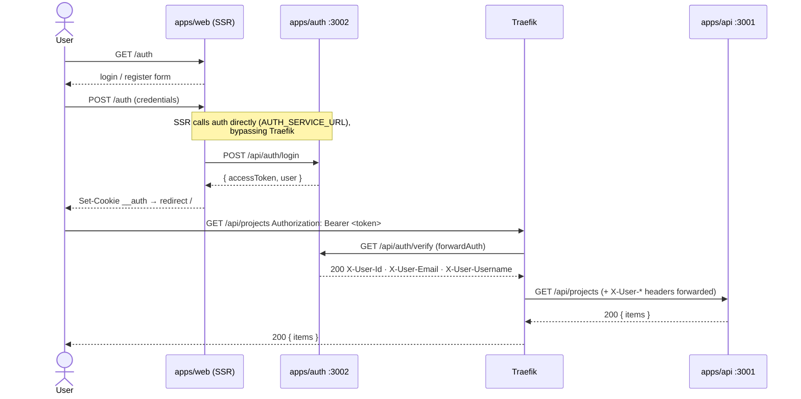
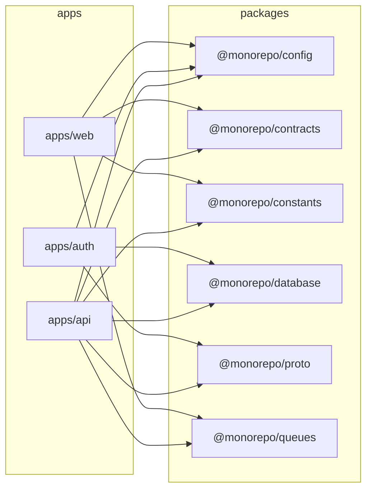

# Monorepo Boilerplate

PNPM workspace with a React Router v7 SSR frontend, a NestJS API, a NestJS auth microservice, and Traefik as the API gateway.

| App / Package | Description |
| --- | --- |
| `apps/web` | React Router v7 framework app with server-side rendering |
| `apps/auth` | NestJS auth microservice — register, login, JWT issuance |
| `apps/api` | NestJS API server — projects, BullMQ, RabbitMQ |
| `packages/config` | Shared env/config helpers for ports, origins, and API paths |
| `packages/constants` | Shared queue names, BullMQ defaults, and event constants |
| `packages/contracts` | Shared TypeScript contracts consumed by both apps |
| `packages/database` | Shared Drizzle ORM schema, client, and repositories |
| `packages/proto` | Shared Protobuf definitions and TypeScript interfaces for gRPC |
| `packages/queues` | Shared BullMQ and RabbitMQ helpers consumed by both apps |

---

## Architecture

### System Overview



Traefik determines route priority by rule length — `PathPrefix('/api/auth')` (longer) wins over `PathPrefix('/api')` automatically, so auth routes are never gated by the JWT middleware.

### Auth Request Flow



### Package Dependency Graph



### Service Ports

| Service | Port | Notes |
| --- | --- | --- |
| Traefik | `80` | Single ingress for browser traffic |
| Traefik dashboard | `8080` | Dev only |
| apps/web | `5173` | Also served through Traefik at `/` |
| apps/auth | `3002` | Also served through Traefik at `/api/auth` |
| apps/auth gRPC | `5001` | Internal gRPC server, consumed by apps/api |
| apps/api | `3001` | Also served through Traefik at `/api` (JWT required) |
| PostgreSQL | `5432` | Shared by auth and api |
| Redis | `6379` | BullMQ job queue (api only) |
| RabbitMQ | `5672` | Message broker (`15672` management UI) |

---

For production deployment instructions see [DEPLOY.md](DEPLOY.md).

---

## Requirements

- Node.js 24+
- pnpm 10+

## Install

```bash
pnpm install
```

The shared workspace packages build to `dist/` and root install runs that build automatically.

Example environment files are provided in:

- `apps/web/.env.example`
- `apps/api/.env.example`
- `packages/database/.env.example`

## Development

Run both apps together:

```bash
pnpm dev
```

This builds the shared workspace packages first, then watches them while the apps run.

Run the full dev stack with Docker Compose:

```bash
docker compose -f docker-compose.dev.yml up --build
```

This starts:

- `web` on <http://localhost:5173>
- `api` on <http://localhost:3001>
- `postgres` on <http://localhost:5432>
- `redis` on <http://localhost:6379>
- `rabbitmq` on <http://localhost:5672> with management UI on <http://localhost:15672>

Stop the stack with:

```bash
docker compose -f docker-compose.dev.yml down
```

App URLs:

- Web: <http://localhost:5173>
- API: <http://localhost:3001>

The SSR home route calls the Nest API health endpoint during its loader.

- Health endpoint: <http://localhost:3001/health>
- Projects endpoint: <http://localhost:3001/api/projects>
- Queue status endpoint: <http://localhost:3001/api/projects/queue>
- RabbitMQ status endpoint: <http://localhost:3001/api/rabbitmq>
- RabbitMQ publish endpoint: `POST /api/rabbitmq/projects/sync`
- Optional server-side override: set `API_URL` before starting the web app
- Optional shared env values: `WEB_PORT`, `API_PORT`, `WEB_URL`, `API_URL`, `PUBLIC_API_BASE_PATH`, `DATABASE_URL`, `REDIS_URL`, `RABBITMQ_URL`, `BULLMQ_ENABLED`, `RABBITMQ_ENABLED`, `BULLMQ_PREFIX`, `AUTH_GRPC_PORT`, `AUTH_GRPC_URL`
- Shared response type: `ApiHealth` from `@monorepo/contracts`

Example:

```bash
API_URL=http://127.0.0.1:3001 pnpm dev:web
```

The shared config package exports helpers used by both apps:

- `getWebPort()` and `getApiPort()`
- `getWebOrigin()` and `getApiOrigin()`
- `getPublicApiBasePath()`, `getHealthUrl()`, and `getProjectsUrl()`
- `getDatabaseUrl()`
- `getRedisUrl()`, `getRabbitMqUrl()`, `isBullMqEnabled()`, `isRabbitMqEnabled()`, `getBullMqPrefix()`, and `getProjectsQueueName()`
- `getAuthGrpcPort()` and `getAuthGrpcUrl()`

Drizzle usage in this starter:

- The database package owns the PostgreSQL schema, client, and repositories
- The API app consumes `@monorepo/database` through a Nest database service
- The projects endpoint is backed by Drizzle and seeds default rows if the table is empty

BullMQ usage in this starter:

- The web app can enqueue a projects sync job from the SSR route through `@monorepo/queues/bullmq`
- The API app uses `@nestjs/bullmq` for the worker integration and exposes queue status at `/api/projects/queue`
- Queue names, BullMQ retry/backoff defaults, cleanup policy, and worker event names live in `@monorepo/constants`

RabbitMQ usage in this starter:

- The shared `@monorepo/queues/rabbitmq` entrypoint still exposes low-level helpers for non-Nest consumers or publishers
- The API app itself now uses Nest microservices transport for RabbitMQ
- The sample consumer is implemented with `@MessagePattern('projects.sync')`
- The sample publisher endpoint at `POST /api/rabbitmq/projects/sync` publishes through Nest `ClientProxy`
- Queue and pattern defaults live in `@monorepo/constants`

gRPC usage in this starter:

- The `packages/proto` package owns the Protobuf definitions (`proto/auth.proto`) and exports TypeScript interfaces and `getAuthProtoPath()` for resolving the `.proto` file at runtime
- The auth service exposes a gRPC server on port `5001` via `Transport.GRPC` (env: `AUTH_GRPC_PORT`)
- Two RPCs are implemented in `apps/auth/src/auth-grpc/auth-grpc.controller.ts`:
  - `VerifyToken` — decodes a JWT and returns `{ valid, userId, email, username }`
  - `GetUser` — looks up a user by ID and returns `{ found, userId, email, username }`
- The API app registers a `ClientsModule` gRPC client pointing to `AUTH_GRPC_URL` (default: `127.0.0.1:5001`)
- `AuthGrpcService` in `apps/api/src/auth-grpc/auth-grpc.service.ts` wraps the client and can be injected into any feature module:

```typescript
// Inject into any service or controller inside apps/api
constructor(private readonly authGrpcService: AuthGrpcService) {}

this.authGrpcService.verifyToken(token).subscribe(res => { /* res.valid, res.userId */ });
this.authGrpcService.getUser(userId).subscribe(res => { /* res.found, res.username */ });
```

- Test directly with `grpcurl`:

```bash
grpcurl -plaintext -proto packages/proto/proto/auth.proto \
  -d '{"token":"<jwt>"}' localhost:5001 auth.AuthService/VerifyToken

grpcurl -plaintext -proto packages/proto/proto/auth.proto \
  -d '{"user_id":"<uuid>"}' localhost:5001 auth.AuthService/GetUser
```

Run one app at a time:

```bash
pnpm dev:web
pnpm dev:api
```

## Production

Build both apps:

```bash
pnpm build
```

If you only need the shared workspace packages rebuilt, run:

```bash
pnpm run build:packages
```

Generate a new shared workspace package:

```bash
pnpm gen:package my-package
```

This creates `packages/my-package` with a standard `package.json`, `tsconfig.json`, and `src/index.ts`. New packages are picked up automatically by `build:packages`, `watch:packages`, `typecheck`, and `clean`.

Advanced generator options:

```bash
pnpm gen:package my-package --workspace-dep config --workspace-dep contracts --dep zod@^4.3.6 --export cli --export internal/helpers --with-test
```

Supported flags:

- `--workspace-dep <name>` adds `@monorepo/<name>: workspace:*` to `dependencies`
- `--dep <name@version>` adds an external dependency to `dependencies`
- `--export <subpath>` creates `src/<subpath>/index.ts` and registers `./<subpath>` in `exports`
- `--with-test` creates `src/index.test.ts` and adds a package-level `test` script

Database helpers:

```bash
pnpm run db:generate
pnpm run db:migrate
pnpm run db:push
pnpm run db:studio
```

Start both production servers:

```bash
pnpm start
```

Default production ports:

- Web: <http://localhost:3000>
- API: <http://localhost:3001>

## Other Scripts

```bash
pnpm typecheck
pnpm lint
pnpm test
pnpm test:e2e
pnpm format
```
