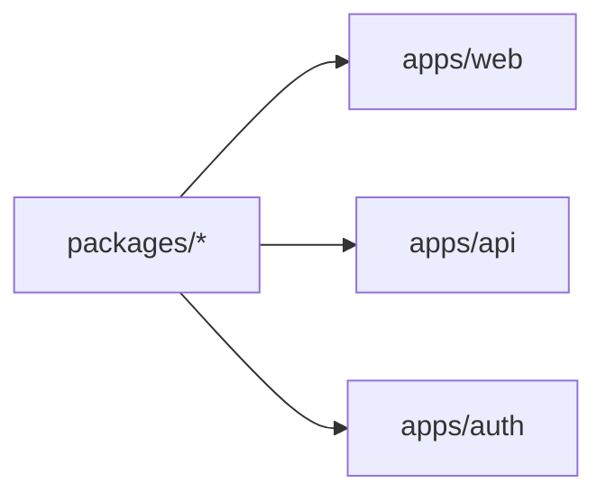

# Codebase Summary

Quick-reference guide to the monorepo structure, key packages, and file locations.

## Directory Tree

```
monorepo/
├── apps/                          # Three runnable applications
│   ├── api/                       # NestJS API service (:3001)
│   ├── auth/                      # NestJS auth microservice (:3002, gRPC :5001)
│   └── web/                       # React Router v7 SSR frontend (:5173)
├── packages/                      # Shared workspace libraries
│   ├── config/                    # Environment configuration helpers
│   ├── constants/                 # Queue names, BullMQ defaults, events
│   ├── contracts/                 # Shared TypeScript types/interfaces
│   ├── database/                  # Drizzle ORM (dual sub-path exports)
│   ├── proto/                     # gRPC Protobuf definitions
│   └── queues/                    # BullMQ and RabbitMQ utilities
├── docker/                        # Docker and database initialization
├── scripts/                       # Build and generator scripts
├── .claude/                       # Claude Code configuration
├── CLAUDE.md                      # Developer workflow guide
├── DEPLOY.md                      # Production deployment guide
├── README.md                      # Project overview and architecture
└── docs/                          # Documentation (this directory)
```

## Apps

### apps/api — NestJS API Server (Port 3001)

**Purpose**: RESTful API for business logic, project management, and job coordination.

**Key Directories**:
- `src/auth-grpc/` — gRPC client to auth service (token verification, user lookup)
- `src/config/` — RuntimeConfigService (environment variables)
- `src/database/` — Database module and DatabaseService
- `src/projects/` — Projects CRUD, queue service, worker processor
- `src/rabbitmq/` — RabbitMQ publisher and consumer
- `test/` — Jest unit tests and e2e tests

**Main Files**:
- `app.module.ts` — Root module with all feature modules
- `main.ts` — Application bootstrap
- `Dockerfile` — Multi-stage Docker build

**Controllers**:
| Controller | Routes | Purpose |
|-----------|--------|---------|
| `AppController` | `GET /health` | Health check for load balancers |
| `ProjectsController` | `GET /api/projects`, `GET /api/projects/queue` | Project data and queue status |
| `RabbitMqController` | `GET /api/rabbitmq`, `POST /api/rabbitmq/projects/sync` | RabbitMQ status and manual sync |

**Services**:
- `RuntimeConfigService` — Validates and provides environment variables
- `DatabaseService` — Creates API database connection and projects repository
- `ProjectsService` — Business logic for project retrieval and processing
- `ProjectsQueueService` — BullMQ job enqueueing
- `RabbitMqService` — RabbitMQ status tracking
- `RabbitMqPublisherService` — Publishing messages to RabbitMQ
- `AuthGrpcService` — Token verification and user lookup via gRPC

**Environment Variables**:
```
API_PORT=3001
API_DATABASE_URL=postgresql://...
REDIS_URL=redis://...
RABBITMQ_URL=amqp://...
BULLMQ_ENABLED=true
RABBITMQ_ENABLED=true
AUTH_GRPC_URL=auth:5001
```

---

### apps/auth — NestJS Auth Microservice (HTTP :3002, gRPC :5001)

**Purpose**: User authentication, JWT token generation, and gRPC verification service.

**Key Directories**:
- `src/auth/` — Login, registration, JWT strategy
- `src/auth-grpc/` — gRPC server implementation
- `src/config/` — RuntimeConfigService
- `src/database/` — Database module and DatabaseService

**Main Files**:
- `app.module.ts` — Root module with auth + gRPC modules
- `main.ts` — Application bootstrap
- `Dockerfile` — Multi-stage Docker build

**Controllers**:
| Controller | Routes | Purpose |
|-----------|--------|---------|
| `AuthController` (HTTP) | `POST /api/auth/register`, `POST /api/auth/login`, `GET /api/auth/me`, `GET /api/auth/verify` | User registration, login, session retrieval, token verification |
| `AuthGrpcController` (gRPC) | `VerifyToken`, `GetUser` | RPCs for API service communication |

**Guards & Strategies**:
- `JwtAuthGuard` — Passport JWT strategy for protected endpoints
- `jwt.strategy.ts` — Extracts and validates Bearer tokens

**DTOs**:
- `RegisterDto` — email, username (min 3), password (min 8)
- `LoginDto` — email, password (min 8)

**Services**:
- `RuntimeConfigService` — Environment variables
- `DatabaseService` — Auth database connection and users repository
- `AuthService` — bcryptjs hashing (12 rounds), JWT token generation (7-day expiry)

**Environment Variables**:
```
AUTH_PORT=3002
AUTH_GRPC_PORT=5001
AUTH_DATABASE_URL=postgresql://...
JWT_SECRET=your-jwt-secret
JWT_EXPIRY=7d
```

---

### apps/web — React Router v7 SSR Frontend (Port 5173)

**Purpose**: Server-side rendered frontend with authentication and data loading using file-based module routing.

**Key Directories**:
- `app/modules/` — File-based routing (auto-generated routes from `**/ pages/**/*.tsx`)
  - `__root.tsx` — Root layout component (shared for all routes)
  - `__homepage.tsx` — Home route (index)
  - `auth/pages/` — Auth routes
  - `admin/pages/` — Admin routes
- `app/lib/` — Session management, utilities
- `public/` — Static assets

**Main Files**:
- `app/routes.ts` — Route configuration using `buildGlobRouteConfig` + `import.meta.glob`
- `app/app.css` — Tailwind CSS styles (dark mode support)
- `react-router.config.ts` — React Router configuration
- `vite.config.ts` — Vite bundler configuration

**Routes** (auto-generated from modules structure):
| Route | File | Purpose |
|-------|------|---------|
| `/` | `modules/__homepage.tsx` | Home page with projects + queue status |
| `/auth` | `modules/auth/pages/index.tsx` | Login/register forms |
| `/auth/logout` | `modules/auth/pages/logout.tsx` | Logout endpoint |
| `/admin` | `modules/admin/pages/index.tsx` | Admin dashboard |

**Loaders**:
- Home loader: Fetches `/health`, `/api/projects`, `/api/projects/queue` via Promise.allSettled
- Auth loader: Redirects authenticated users to `/`

**Actions**:
- Auth action: POST to AUTH_SERVICE_URL for register/login

**Session Management** (`lib/session.server.ts`):
- Cookie-based (`__auth`)
- HttpOnly, SameSite=lax
- 7-day maxAge
- Requires `SESSION_SECRET` env variable

**Styling**:
- Tailwind CSS v4
- Dark mode support via `prefers-color-scheme`

**Environment Variables**:
```
WEB_PORT=5173
AUTH_SERVICE_URL=http://localhost:3002
API_URL=http://localhost:3001
API_BASE_PATH=/api
SESSION_SECRET=your-session-secret
```

---

## Packages

### @monorepo/config

**Purpose**: Centralized environment configuration with Zod validation.

**Key Exports**:
- `validateRuntimeEnv()` — Zod schema for validation
- `getValidatedRuntimeEnv()` — Returns validated config object
- Port/URL helpers: `getWebPort()`, `getApiPort()`, `getWebOrigin()`, `getApiOrigin()`
- Database URLs: `getAuthDatabaseUrl()`, `getApiDatabaseUrl()`
- Queue helpers: `getRedisUrl()`, `getRabbitMqUrl()`, `isBullMqEnabled()`, `isRabbitMqEnabled()`, `getBullMqPrefix()`, `getProjectsQueueName()`
- gRPC helpers: `getAuthGrpcPort()`, `getAuthGrpcUrl()`
- Utility: `maskConnectionUrl()` (redacts credentials)

**Location**: `packages/config/src/index.ts`

**Dependencies**: zod@^4.3.6

---

### @monorepo/constants

**Purpose**: Pure constant values shared across apps (no runtime dependencies).

**Key Exports**:
- **BullMQ**: `PROJECTS_QUEUE_DEFAULT_JOB_ATTEMPTS=3`, exponential backoff 5s, keep 100 completed/failed
- **Queues**: `PROJECTS_QUEUE_NAME='projects'`, `PROJECTS_SYNC_JOB_NAME='projects.sync'`
- **RabbitMQ**: exchange `'projects.events'` (topic), pattern `'projects.sync'`, queue `'projects.sync.api'`
- **Types**: `ProjectsSyncJobData`, `ProjectsSyncJobResult`, `ProjectsQueueStatus`, `ProjectsQueueWorkerStatus`

**Location**: `packages/constants/src/`

---

### @monorepo/contracts

**Purpose**: Shared TypeScript interfaces for API responses and domain models.

**Key Types**:
- `ApiHealth` — Health check response
- `ProjectStatus` — Enum for project states
- `ProjectSummary` — Single project data
- `ProjectsResponse` — API list response
- `RabbitMqStatus` — Queue system status

**Location**: `packages/contracts/src/index.ts`

---

### @monorepo/database

**Purpose**: Drizzle ORM for both databases (dual sub-path exports).

**Sub-path Exports**:

#### @monorepo/database/auth
- `createAuthDatabase()` — Initialize auth database
- `closeAuthDatabase()` — Cleanup connection
- `authSchema` — Users table definition
- `UsersRepository` — Query builder (findByEmail, findByUsername, findById, create)

**Users Table Schema**:
- `id` (TEXT, primary key, UUID)
- `email` (TEXT, unique)
- `username` (TEXT, unique)
- `password_hash` (TEXT)
- `created_at` (TIMESTAMP)
- `updated_at` (TIMESTAMP)

#### @monorepo/database/api
- `createApiDatabase()` — Initialize API database
- `closeApiDatabase()` — Cleanup connection
- `apiSchema` — Projects table definition
- `ProjectsRepository` — Query builder (list, seedDefaults)

**Projects Table Schema**:
- `id` (TEXT, primary key, UUID)
- `name` (TEXT)
- `summary` (TEXT)
- `status` (ENUM: pending, in_progress, completed)
- `stack` (TEXT[], JSON array)
- `updated_at` (TIMESTAMP)
- `created_at` (TIMESTAMP)

**Drizzle Configs**:
- `drizzle.auth.config.ts` — Reads `AUTH_DATABASE_URL`, migrations in `drizzle/auth/`
- `drizzle.api.config.ts` — Reads `API_DATABASE_URL`, migrations in `drizzle/api/`

**Location**: `packages/database/src/`

---

### @monorepo/proto

**Purpose**: Protobuf definitions and gRPC TypeScript interfaces.

**Key Exports**:
- `getAuthProtoPath()` — Resolves `.proto` file path at runtime (uses `import.meta.url`)
- TypeScript interfaces for `VerifyTokenRequest`, `VerifyTokenResponse`, `GetUserRequest`, `GetUserResponse`
- `AUTH_GRPC_SERVICE_NAME = 'AuthService'`
- `AUTH_GRPC_PACKAGE_NAME = 'auth'`

**Proto Definition** (`proto/auth.proto`):
```protobuf
service AuthService {
  rpc VerifyToken(VerifyTokenRequest) returns (VerifyTokenResponse);
  rpc GetUser(GetUserRequest) returns (GetUserResponse);
}
```

**Location**: `packages/proto/`

---

### @monorepo/queues

**Purpose**: BullMQ and RabbitMQ helpers with sub-path exports.

#### @monorepo/queues/bullmq
- `getBullMqConnection()` — Redis connection pool
- `createProjectsQueue()` — BullMQ queue instance
- `createProjectsWorker()` — Job worker with retry logic
- `enqueueProjectsSync()` — Enqueue a new sync job
- `assertBullMqEnabled()` — Validation check

#### @monorepo/queues/rabbitmq
- `createRabbitMqConnection()` — AMQP connection
- `createRabbitMqChannel()` — Message channel
- `assertProjectsRabbitMqTopology()` — Create exchange/queue/binding
- `publishProjectsSync()` — Publish message to topic
- `assertRabbitMqEnabled()` — Validation check

**Location**: `packages/queues/src/`

---

## Key Patterns & Conventions

### Module Structure (NestJS)

Every feature module includes:
```typescript
// feature.module.ts
@Module({
  imports: [/* other modules */],
  controllers: [FeatureController],
  providers: [FeatureService],
  exports: [FeatureService],
})
export class FeatureModule {}
```

Global modules (available everywhere):
- `RuntimeConfigModule` — Configuration service
- `DatabaseModule` — Database connections and repositories

### Repository Pattern

```typescript
// Defined in packages/database
export function createUsersRepository(db: AuthDatabase) {
  return {
    findByEmail: (email: string) => db.query.users.findFirst(...),
    create: (data: User) => db.insert(usersTable).values(data),
  };
}

// Injected into service
constructor(private readonly db: DatabaseService) {
  this.usersRepository = createUsersRepository(db.client);
}
```

### TypeScript Configuration

**NestJS Apps** (`apps/*/tsconfig.json`):
- `"module": "nodenext"`
- `"moduleResolution": "nodenext"`
- `"emitDecoratorMetadata": true`
- `"isolatedModules": true`
- `"experimentalDecorators": true`

**Packages** (`packages/*/tsconfig.json`):
- `"module": "ES2022"`
- `"moduleResolution": "bundler"`
- Output to `dist/` with `"declaration": true`

### Build Order



Dependencies must build first. `pnpm dev` handles this automatically.

### Conditional Features

BullMQ and RabbitMQ are optional:

```typescript
const isBullMqEnabled = runtimeConfig.isBullMqEnabled();
if (isBullMqEnabled) {
  // Import queue module
}
```

Environment flags: `BULLMQ_ENABLED`, `RABBITMQ_ENABLED`

### Error Handling Patterns

```typescript
// NestJS uses HttpException
throw new BadRequestException('Invalid credentials');
throw new UnauthorizedException('Token expired');

// Service layer throws business exceptions
throw new Error('User not found');
```

### Testing Strategy

- **Unit tests**: Jest in `src/**/*.spec.ts`
- **E2E tests**: Jest in `test/**/*.e2e-spec.ts`
- **Coverage**: Aim for > 80% on critical paths
- **Run**: `pnpm test`, `pnpm test:e2e`

## Database Initialization

```bash
# Dev (via Docker)
docker/postgres-init.sql creates both databases on startup

# Local
psql -U postgres -c "CREATE DATABASE monorepo_auth;"
psql -U postgres -c "CREATE DATABASE monorepo_api;"
pnpm db:push:auth
pnpm db:push:api
```

## Port Reference

| Service | Port | Purpose |
|---------|------|---------|
| Traefik | 80 | Browser ingress |
| Traefik dashboard | 8080 | Dev only |
| apps/web | 5173 | Dev SSR server |
| apps/auth HTTP | 3002 | Auth endpoints |
| apps/auth gRPC | 5001 | Service-to-service |
| apps/api | 3001 | API endpoints |
| PostgreSQL | 5432 | Both databases |
| Redis | 6379 | BullMQ queue |
| RabbitMQ | 5672 | Message broker |
| RabbitMQ UI | 15672 | Management console |

## Common Commands

```bash
# Development
pnpm dev                    # All apps + watchers
pnpm dev:web               # Web only
pnpm dev:api               # API only
pnpm --filter auth dev     # Auth only

# Building
pnpm build                 # All packages + apps
pnpm -r --filter './packages/*' build  # Packages only

# Database
pnpm db:push:auth          # Apply schema to auth DB
pnpm db:generate:auth      # Create migration file
pnpm db:studio:auth        # Open Drizzle Studio

# Testing
pnpm test                  # Unit tests
pnpm test:e2e              # E2E tests

# Package generation
pnpm gen:package my-feature --workspace-dep config --dep zod@^4.3.6
```

## Important Gotchas

1. **`pnpm run build:packages`** requires quoted glob when run manually
2. **`isolatedModules` + `emitDecoratorMetadata`**: NestJS interfaces need `import type` + cast in `onModuleInit`
3. **Global modules**: DatabaseModule and RuntimeConfigModule are already global — don't re-import
4. **Build order**: Packages must build before apps
5. **Node.js built-ins**: Require `@types/node` in packages and `"types": ["node"]` in tsconfig

## Version Info

- Node.js: 24+
- pnpm: 10.32.1+
- NestJS: 11.x
- React Router: 7.12.0+
- TypeScript: 5.x
- Drizzle ORM: Latest (no version lock)
